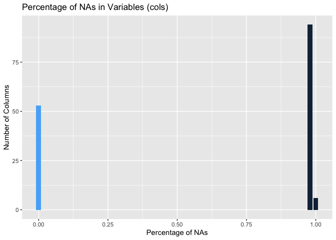
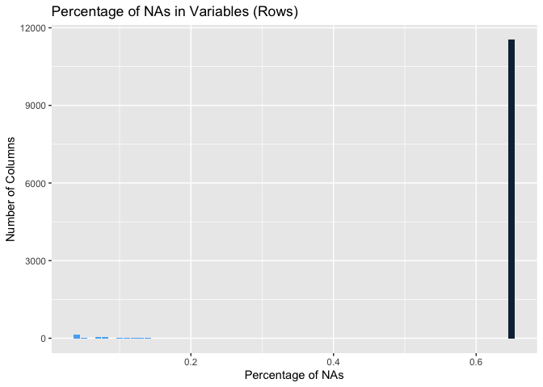

People often quantify how much of a particular activity they do, but
they rarely quantify how well they do it. Using measurement data from
accelerometers on the belt, forearm, arm, and dumbell of six
participants during their weight-lifting exercises, this report uses
machine learning to predict how well they perform each movement. Working
with the training dataset from Velloso et al, I create an algorithm
based on the classification of the quality of each movement (variable
“classe”) and apply that to the authors’ testing data.

References: Velloso, E.; Bulling, A.; Gellersen, H.; Ugulino, W.; Fuks,
H. Qualitative Activity Recognition of Weight Lifting Exercises.
Proceedings of 4th International Conference in Cooperation with SIGCHI
(Augmented Human ’13). Stuttgart, Germany: ACM SIGCHI, 2013.

Data: Training Data -
<a href="https://d396qusza40orc.cloudfront.net/predmachlearn/pml-training.csv" class="uri">https://d396qusza40orc.cloudfront.net/predmachlearn/pml-training.csv</a>
Testing Data -
<a href="https://d396qusza40orc.cloudfront.net/predmachlearn/pml-testing.csv" class="uri">https://d396qusza40orc.cloudfront.net/predmachlearn/pml-testing.csv</a>

    ## Loading required package: lattice

    ## 
    ## Attaching package: 'dplyr'

    ## The following objects are masked from 'package:stats':
    ## 
    ##     filter, lag

    ## The following objects are masked from 'package:base':
    ## 
    ##     intersect, setdiff, setequal, union

    ## randomForest 4.6-14

    ## Type rfNews() to see new features/changes/bug fixes.

    ## 
    ## Attaching package: 'randomForest'

    ## The following object is masked from 'package:dplyr':
    ## 
    ##     combine

    ## The following object is masked from 'package:ggplot2':
    ## 
    ##     margin

Loading the Data
----------------

First, I load the two datasets provided by the authors: one training and
one testing. To improve the quality of our predictions through
cross-validation, the training dataset will serve as both the training
and the test data, while the (signficantly smaller) testing set will be
the actual test of our predictions.

    data <- read.csv("pml-training.csv")
    prediction_data <- read.csv("pml-testing.csv")

    trainset <- createDataPartition(y=data$classe, p=0.6, list=FALSE)
    training <- data[trainset, ] 
    testing <- data[-trainset, ]

Cleaning the Data
-----------------

By looking at each columns, we can notice how wome variables are not
necessary—such as the row number, user\_name, timestamp, as well as the
window number and type. I remove those.

    training <- training[,-c(1:7)]
    testing <- testing[,-c(1:7)]

After excluding the first seven columns, I noticed that all remaining
variables are numeric. Due to the fact that the dataset comes from a
spreadsheet program, some entries are either empty, with a “NA” string,
or with an error message. Luckily, the as.numeric function converts all
of those non-numeric elements into NAs.

    for (j in 1:(ncol(training)-1)) {
      training[,j] <- as.numeric(training[,j])
    }
    for (j in 1:(ncol(testing)-1)) {
      testing[,j] <- as.numeric(testing[,j])
    }

After this conversion, it becomes noticeable that the dataset has a lot
of missing values. Since machine learning algorithms struggle with NAs
and the approach to these can vary, I first measure the percentage of
NAs in the entire data for each variable (column) and observation (row)

    # Percentage of Variables that are NA
    col_NAs <- colSums(is.na(training))/nrow(training)
    # Percentage of Observations that are NA
    row_NAs <- rowSums(is.na(training))/ncol(training)

What quickly becomes apparent is that, in this dataset, the variables
either are composed almost exclusively by NAs or have none or few
missing values.

    table_col_NAs <- as.data.frame(table(col_NAs))
    table_col_NAs$col_NAs <- round(as.numeric(as.character(table_col_NAs$col_NAs)), digits = 2)

    ggplot(table_col_NAs, aes(col_NAs, Freq, fill = -col_NAs)) +
      geom_bar(stat = "identity") +
      ggtitle("Percentage of NAs in Variables (cols)") +
      theme(legend.position = "none") +
      xlab("Percentage of NAs") +
      ylab("Number of Columns")

Given this prevalence of NAs in many columns, it might be best to just
exclude this variables from the algorithm. However, even if most
variables have a lot of NAs, maybe the few numeric entries they possess
are shared across all columns—meaning, a few observations actually
possess all measurements. Since we could actually just use those
observations, we can repeat the same process and plot the percentage of
NA values by row:

    table_row_NAs <- as.data.frame(table(row_NAs))
    table_row_NAs$row_NAs <- round(as.numeric(as.character(table_row_NAs$row_NAs)), 2)

    ggplot(table_row_NAs, aes(row_NAs, Freq, fill = -Freq)) +
      geom_bar(stat = "identity") +
      ggtitle("Percentage of NAs in Variables (Rows)") +
      xlab("Percentage of NAs") +
      theme(legend.position = "none") +
      ylab("Number of Columns")

As it happens, almost all observations have incomplete data in a
significant number of variables. Since there are more columns than rows
with full data, I opted to eliminate the columns with more than 90% NAs.

    training <- training[, colSums(is.na(training)) < 0.1]
    testing <- testing[, colSums(is.na(testing)) < 0.1]

Finally, before creating the algorithm, we just need to make sure our
outcome is a factor.

    training$classe <- as.factor(training$classe)
    testing$classe <- as.factor(testing$classe)

Training the Algorithm (Random Forest)
--------------------------------------

By using a simple function, we can train an algorithm with the Random
Forest method, known by its accuracy.

    modFit_rf <- randomForest(classe ~. , data = training)

Once we have our algorithm, we can apply it to our training data and
estimate its accuracy.

    train_rf <- predict(modFit_rf, training, type = "class")
    confusionMatrix(train_rf, training$classe)

    ## Confusion Matrix and Statistics
    ## 
    ##           Reference
    ## Prediction    A    B    C    D    E
    ##          A 3348    0    0    0    0
    ##          B    0 2279    0    0    0
    ##          C    0    0 2054    0    0
    ##          D    0    0    0 1930    0
    ##          E    0    0    0    0 2165
    ## 
    ## Overall Statistics
    ##                                      
    ##                Accuracy : 1          
    ##                  95% CI : (0.9997, 1)
    ##     No Information Rate : 0.2843     
    ##     P-Value [Acc > NIR] : < 2.2e-16  
    ##                                      
    ##                   Kappa : 1          
    ##                                      
    ##  Mcnemar's Test P-Value : NA         
    ## 
    ## Statistics by Class:
    ## 
    ##                      Class: A Class: B Class: C Class: D Class: E
    ## Sensitivity            1.0000   1.0000   1.0000   1.0000   1.0000
    ## Specificity            1.0000   1.0000   1.0000   1.0000   1.0000
    ## Pos Pred Value         1.0000   1.0000   1.0000   1.0000   1.0000
    ## Neg Pred Value         1.0000   1.0000   1.0000   1.0000   1.0000
    ## Prevalence             0.2843   0.1935   0.1744   0.1639   0.1838
    ## Detection Rate         0.2843   0.1935   0.1744   0.1639   0.1838
    ## Detection Prevalence   0.2843   0.1935   0.1744   0.1639   0.1838
    ## Balanced Accuracy      1.0000   1.0000   1.0000   1.0000   1.0000

As we can see, our predictions were 100% accurate: by taking into
consideration the values in all of our variables, we perfectly predicted
the “classe” of each observation—we correctly estimated the quality of
the weight lifting movement.

Of course, a high accuracy—low in sample error—is to be expected from
the training data. To make sure our algorithm can be applied to new
data, I repeat the process for the testing dataset.

    test_rf <- predict(modFit_rf, testing, type = "class")
    confusionMatrix(test_rf, testing$classe)

    ## Confusion Matrix and Statistics
    ## 
    ##           Reference
    ## Prediction    A    B    C    D    E
    ##          A 2232   11    0    0    0
    ##          B    0 1503    5    0    0
    ##          C    0    4 1359   14    0
    ##          D    0    0    4 1272   10
    ##          E    0    0    0    0 1432
    ## 
    ## Overall Statistics
    ##                                           
    ##                Accuracy : 0.9939          
    ##                  95% CI : (0.9919, 0.9955)
    ##     No Information Rate : 0.2845          
    ##     P-Value [Acc > NIR] : < 2.2e-16       
    ##                                           
    ##                   Kappa : 0.9923          
    ##                                           
    ##  Mcnemar's Test P-Value : NA              
    ## 
    ## Statistics by Class:
    ## 
    ##                      Class: A Class: B Class: C Class: D Class: E
    ## Sensitivity            1.0000   0.9901   0.9934   0.9891   0.9931
    ## Specificity            0.9980   0.9992   0.9972   0.9979   1.0000
    ## Pos Pred Value         0.9951   0.9967   0.9869   0.9891   1.0000
    ## Neg Pred Value         1.0000   0.9976   0.9986   0.9979   0.9984
    ## Prevalence             0.2845   0.1935   0.1744   0.1639   0.1838
    ## Detection Rate         0.2845   0.1916   0.1732   0.1621   0.1825
    ## Detection Prevalence   0.2859   0.1922   0.1755   0.1639   0.1825
    ## Balanced Accuracy      0.9990   0.9947   0.9953   0.9935   0.9965

Although the accuracy decrease—the out sample error is always
greater—our predictions were almost perfect, with an accuracy of 0.9917.
This is certainly confident enough to apply the algorithm to the
original test data.

Prediction
----------

Before predicting, we just need to make sure the data is correctly
formatted—meaning the variables are numeric.

    for (j in 1:ncol(prediction_data)) {
      prediction_data[,j] <- as.numeric(prediction_data[,j])
    }

Finally, we can use the data to state what was the quality—grade A, B,
C, D, or E—of each of the observations.

    official_prediction <- predict(modFit_rf, prediction_data, type = "class")
    print(official_prediction)

    ##  1  2  3  4  5  6  7  8  9 10 11 12 13 14 15 16 17 18 19 20 
    ##  B  A  B  A  A  E  D  B  A  A  B  C  B  A  E  E  A  B  B  B 
    ## Levels: A B C D E
